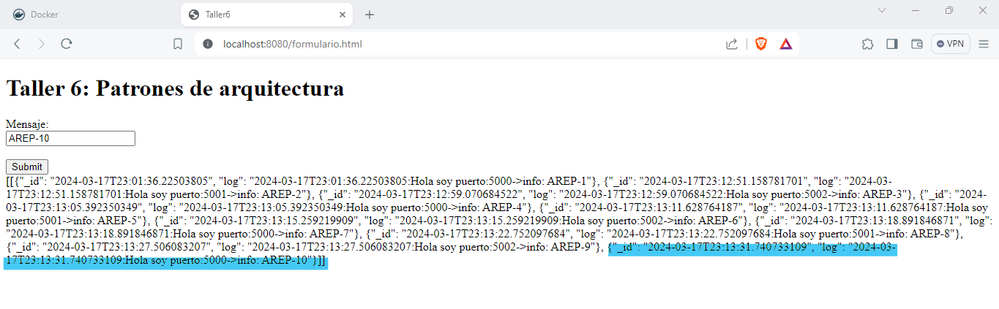
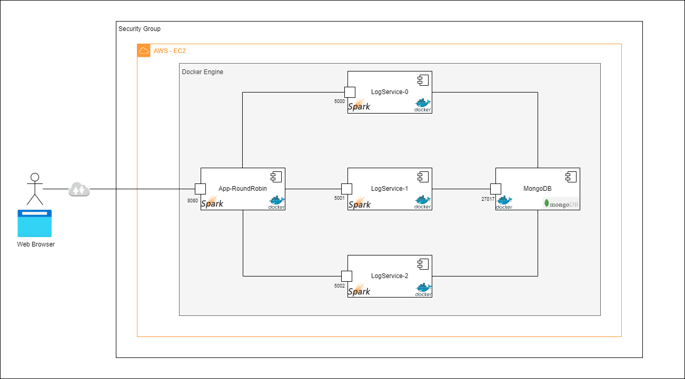

# Taller 6:  TRABAJO INDIVIDUAL DE PATRONES DE ARQUITECTURA

Se ha desarrollado una aplicación web REST que recibe una cadena de texto, la guarda en una base de datos (MongoDB) y devuelve en formato JSON las últimas 10 cadenas junto con sus fechas de almacenamiento.

Esta aplicación web fue creada utilizando el micro-framework de Spark java (http://sparkjava.com/). La cual se desplego en AWS utilizando EC2 y Docker. Esta incluye un balanceador de carga Round Robin que distribuye equitativamente la carga de trabajo entre tres instancias del servicio LogService.

## Prerequisitos
Los prerrequisitos tecnológicos que necesita este taller son:

* Maven

* Git

* Java 17

* Docker

* Docker compose

* Docker hub

* AWS

## Instalación y Ejecución

1. Se clona el repositorio:
```
git clone https://github.com/AREP-2024/Taller6.git
```
2. Ingresamos a la carpeta del repositorio que clonamos anteriormente:
```
cd Taller6
```

Hay dos formas de realizar la instalación y ejecución:

**a. Trayendo las imagenes de DockerHub**
1. Ejecutamos el docker-compose:
```
docker-compose up -d
```
2. Verificamos que los contenedores se estén ejecutando:
```
docker ps
```

También se puede verificar que los contenedores se estén ejecutando en Docker Desktop.

3. Probamos nuestra aplicación accediendo a la siguiente URL en el navegador
```
http://localhost:8080/formulario.html
```


**b. Construyendo las imagenes con el archivo docker-compose.build**
1. Nos movemos a la carpeta appLBRoundRobin:
```
cd appLBRoundRobin
```
2. Construimos el proyecto:
```
mvn package
```
3. Nos movemos nuevamente a la carpeta raíz:
```
cd ..
```
4. Nos movemos a la carpeta logService:
```
cd logService
```
5. Construimos el proyecto:
```
mvn package
```
6. Nos movemos nuevamente a la carpeta raiz:
```
cd ..
```
7. Ejecutamos el docker-compose.build:
```
docker-compose -f docker-compose.build.yml up -d
```
8. Verificamos que los contenedores se esten ejecutando
```
docker ps
```

También se puede verificar que los contenedores se estén ejecutando en Docker Desktop.

9. Probamos nuestra aplicación accediendo a la siguiente URL en el navegador:
```
http://localhost:8080/formulario.html
```


## ¿Cómo fuciona la aplicación?
Para probar la aplicación web se debe ingresar una cadena en el campo de texto y luego dar click en el botón  Submit. Como podemos observar en la siguiente imagen la aplicacion web recibe la cadena, la guardar en una base datos con fecha y hora exacta, para luego retornar la información en formato JSON.

**Nota:** En pantalla también podra observar id,la información del log, el puerto y el mensaje.

En la siguiente imagen podemos observar que los mensajes se agregan al final de la lista de log.

Como se mencionó anteriormente el objetivo de la aplicación es mostrar en pantalla la información de los últimos 10 registros que tiene la base datos, si se ingresa la cadena “AREP-11”, como ejemplo para este caso, la información de la cadena “AREP-1” ya no se verá en pantalla, es decir, que la lista de log comenzara desde la información de la cadena “AREP-2”, observe la siguiente imagen. 

Adiconal a esto se puede observar como el balanceador de carga, Round Robin, distribuye equitativamente la carga de trabajo entre las tres instancias del servicio LogService.


### Ejecución de Test
 
1.Desde la raiz nos movemos a la carpeta appLBRoundRobin
 
```
cd appLBRoundRobin
```
 
2.Ejecutamos las pruebas con el siguiente comando
 
```
mvn test
```
 
3.Nos devolvemos nuevamente a la carpeta raiz
 
```
cd ..
```
 
4.Ahora nos movemos a la carpeta logService
 
```
cd logService
```
 
5.Ejecutamos las pruebas con el siguiente comando
 
```
mvn test
```

## Arquitectura del programa

Esta arquitectura incluye un algoritmo de balanceo de carga Round Robin junto con un servicio LogService que almacena cadenas en una base de datos MongoDB. Para esto se crearon dos proyectos uno para el round robin y otro para el log services, debido a que se están haciendo microservicios y así es más fácil conectar varias instancias. a continuación de describen de una manera más detallada:
 
**Componentes**
* **appLBRoundRobin:** Balanceador de carga Round Robin que distribuye las solicitudes entre múltiples instancias de LogService.
En este caso utilizamos 3 instancias estáticas del servicio LogService. La distribución de las solicitudes se realiza de manera secuencial, comenzando desde la primera instancia, pasando por la segunda y llegando a la tercera, para luego volver nuevamente a la primera. Este enfoque asegura una distribución equitativa de la carga entre todas las instancias disponibles, optimizando así el rendimiento y la disponibilidad del sistema. Así mismo cada una de las cadenas serán enviadas a través de un formulario que se implementó para la aplicación.
 
* **logService:** Servicio REST que recibe cadenas, las almacena en una base de datos MongoDB y devuelve las últimas 10 cadenas almacenadas junto con sus fechas.
 
* **MongoDB:** Base de datos NoSQL utilizada para almacenar las cadenas procesadas por el servicio LogService.

 
 ***Nota: Recordar que logService hace la conexión a MongoDB utilizando el puerto 27017.***

**Estructura Proyecto appLBRoundRobin:**
 
El proyecto está estructurado en diferentes paquetes y clases:
 
***App:*** Clase principal que inicia la aplicación y configura el controlador Spark.
 
**1. integracion**
* **ClienteHttp:** Clase para realizar llamadas HTTP utilizando OkHttp.
 
**2. controlador**
* **Controlador:** Interfaz que define los métodos para los controladores.
 
* **SparkControlador:** Implementación de un controlador Spark para manejar las solicitudes y utilizar el algoritmo de Round Robin.
 
**3. servicio**
* **APPLBRoundRobin:** Clase que implementa el algoritmo de Round Robin para distribuir las solicitudes entre las instancias de LogService.
 
* **LogService:** Clase que representa un servicio LogService y realiza llamadas a otras instancias utilizando el HttpClient.
 
 
**Estructura Proyecto logService:**
 
El proyecto está estructurado en diferentes paquetes y clases:
 
**SparkAPP:** Clase principal que inicia la aplicación LogService.
 
**1. controlAador**
* **Controlador:** Interfaz que define los métodos para los controladores.
 
* **SparkControlador:** Implementación de un controlador Spark para manejar las solicitudes al servicio LogService.
 
**2. persistence**
* **CRUD:** Interfaz para operaciones CRUD (Crear, Leer, Actualizar, Eliminar) en la base de datos MongoDB.
 
* **LogsDAO:** Implementación de operaciones CRUD utilizando MongoDB para gestionar los registros de logs.
 
* **MongoUtil:** Clase para realizar la conexión a la base de datos MongoDB.
 
**3. servicio**
* **LogService:** Clase que representa el servicio LogService y realiza operaciones de guardar y obtener los ultimos 10 logs. 

## Construido con

* [Maven](https://maven.apache.org/): Maven es un herramienta que proporciona una estructura estándar, gestión de dependencias y automatización de tareas en los proyectos software desarrollados en Java.

* [Git](https://platzi.com/blog/que-es-github-como-funciona/): Es una plataforma de desarrollo colaborativo basado en Git que utiliza un sistema de versiones distribuida para el seguimiento del código fuente durante el desarrollo.

* [Java 17](https://www.java.com/es/download/help/java8_es.html): Es un lenguaje de programación de propósito general, orientado a objetos y diseñado para ser independiente de la plataforma.

* [Spark](https://sparkjava.com/):Spark es un framework de Java que permite desarrollar aplicaciones web. Se caracteriza por ser super sencillo y muy ligero.

* [Docker](https://www.docker.com/): Es una plataforma de código abierto diseñada para facilitar la creación, implementación y ejecución de aplicaciones en contenedores.

* [Docker Hub](https://hub.docker.com/): Es un servicio en la nube proporcionado por Docker que actúa como un repositorio centralizado para imágenes Docker. Es un lugar donde los desarrolladores pueden almacenar, distribuir y compartir imágenes Docker públicas y privadas, así como colaborar en proyectos relacionados con Docker.

* [Docker Desktop](https://www.docker.com/products/docker-desktop/): Es una aplicación de escritorio que proporciona una experiencia unificada para desarrollar, implementar y administrar aplicaciones en contenedores Docker en sistemas operativos Windows y macOS.

* [Visual Studio Code](https://code.visualstudio.com/):Es un entorno de desarrollo integrado (IDE) ligero y de código abierto desarrollado por Microsoft.

* [HTML](https://developer.mozilla.org/es/docs/Web/HTML): Es el lenguaje de marcado que se utiliza para crear páginas web. Se define como un conjunto de etiquetas que se utilizan para estructurar y dar significado al contenido de una página web.

* [JavaScript](https://aws.amazon.com/es/what-is/javascript/): Es un lenguaje de programación de alto nivel, interpretado y orientado a objetos. Se utiliza principalmente en el desarrollo web para crear páginas web interactivas y dinámicas.

* [AWS](https://aws.amazon.com/es/):  (Amazon Web Services) es una plataforma de servicios de computación en la nube ofrecida por Amazon.com. Que proporciona una amplia gama de servicios, incluidos almacenamiento, computación, bases de datos, análisis, aprendizaje automático, inteligencia artificial, Internet de las cosas (IoT), seguridad, desarrollo de aplicaciones, redes y mucho más.

* [Mongo DB](https://www.mongodb.com/es): MongoDB es un sistema de gestión de bases de datos NoSQL (no solo SQL) de código abierto, orientado a documentos.

## Autor
[Luisa Fernanda Bermudez Giron](https://www.linkedin.com/in/luisa-fernanda-bermudez-giron-b84001262/) - [Luisa Fernanda Bermudez Giron](https://github.com/LuisaGiron)

## Licencia 
**©** Luisa Fernanda Bermudez Giron, Estudiante de Ingeniería de Sistemas de la Escuela Colombiana de Ingeniería Julio Garavito.